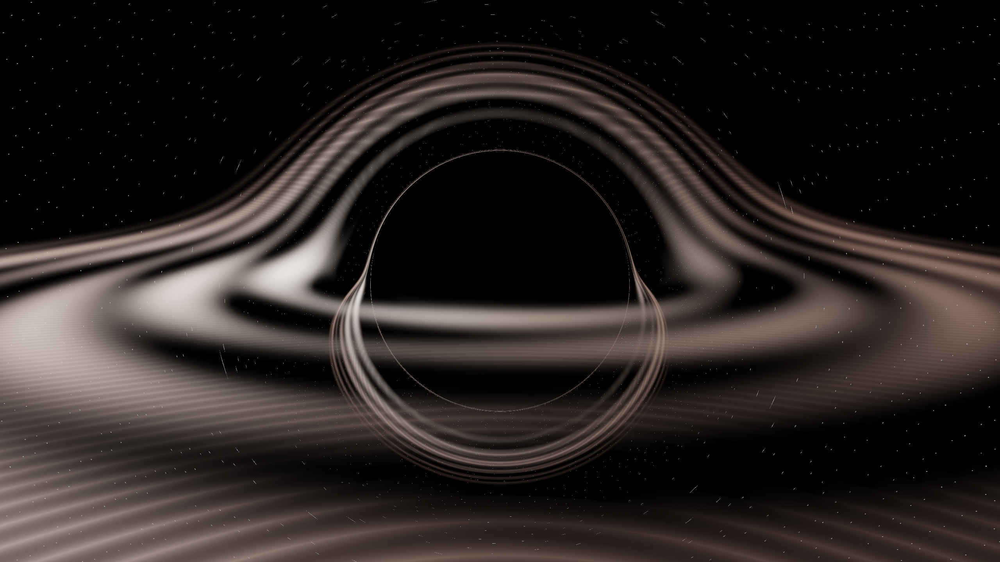

# Black Hole Simulation

A real-time GPU-accelerated black hole simulation using C++20 with Metal ray tracing and accurate physics equations. Features gravitational lensing, volumetric accretion disk rendering, and cinematic camera movements.

<p align="center">
  
  <br>
  <em><a href="assets/demo/demo_blackhole_recording.mp4">🎥 Watch Exported Video Demo</a></em>
</p>

  

## Features

- **GPU Accelerated**: Real-time Metal compute shader ray tracing for maximum performance
- **Dynamic Resolution**: Renders at any window size, adapts to screen resolution (144p to 8K)
- **Fullscreen Support**: Toggle fullscreen mode with F key, ESC to exit
- **Resizable Window**: Drag window edges to resize, rendering adapts automatically
- **Accurate Physics**: Schwarzschild metric geodesic integration using RK4 (Runge-Kutta 4th order)
- **Gravitational Lensing**: Light rays bend according to general relativity equations
- **Volumetric Rendering**: Realistic accretion disk with white-hot temperature gradients
- **Cinematic Camera**: 5 cinematic modes including smooth orbit, wave motion, rising spiral, and close fly-by
- **Continuous Animation**: Camera is always in motion for dynamic viewing experience
- **Video Recording**: Record high-quality videos with Command+R (H.264 encoding)
- **Real-time Performance**: 30+ FPS at any resolution on Apple Silicon

## Prerequisites

- **macOS** with **Apple Silicon** (M1/M2/M3/M4) or Intel with Metal support
- **Xcode Command Line Tools** (for clang++ and Metal compiler)
- **vcpkg** (dependency manager - will be installed in step 2)

> **⚠️ GPU Required**: This simulation requires Metal GPU acceleration and will not run without it.

## Installation

### 1. Clone the Repository

```bash
cd /path/to/your/projects
git clone <your-repo-url> blackhole_simulation
cd blackhole_simulation
```

### 2. Install vcpkg (Dependency Manager)

The project uses vcpkg to manage dependencies (SDL2, SDL2_ttf, ffmpeg). First, clone vcpkg into the project directory:

```bash
# Clone vcpkg into the project
git clone https://github.com/microsoft/vcpkg.git

# Bootstrap vcpkg (builds the vcpkg executable)
./vcpkg/bootstrap-vcpkg.sh
```

### 3. Install Dependencies

Now install all required dependencies (declared in `vcpkg.json`):

```bash
# Install all dependencies (SDL2, SDL2_ttf, ffmpeg)
./vcpkg/vcpkg install
```

This will download and build:
- **SDL2**: Window management and graphics
- **SDL2_ttf**: Text rendering for HUD
- **ffmpeg**: Video recording functionality

### 4. Build the Project

```bash
make
```

The executable will be created in `export/blackhole_sim`.

## Running the Simulation

```bash
make run
# or
./export/blackhole_sim
```

The simulation window will open with the camera automatically orbiting the black hole.

## Controls

| Key | Action |
|-----|--------|
| **F** | Toggle fullscreen mode |
| **+/-** | Increase/Decrease resolution (cycles through presets) |
| **C** | Cycle through cinematic camera modes |
| **IJKL** | Rotate camera view 1(I/K: Right axis, J/L: Up axis) |
| **OU** | Rotate Forward axis (works in all modes) |
| **W/S** | Move camera up/down (Manual mode only) |
| **A/D** | Zoom in/out (Manual mode only) |
| **R** | Reset camera position & rotation |
| **Tab** | Toggle control hints overlay |
| **Cmd+R** | Start video recording |
| **Enter/Esc/Q** | Stop video recording (when recording) |
| **ESC** | Exit fullscreen (if in fullscreen) or quit |
| **Q** | Quit simulation |

### Resolution Presets

The application starts at **1080p FHD (1920×1080)** by default. Available presets (cycle with +/- keys):
- **144p** (256×144) - Ultra low for testing
- **240p** (426×240) - Low resolution
- **360p** (640×360) - Standard definition
- **480p** (854×480) - Enhanced definition
- **720p HD** (1280×720) - High definition
- **1080p FHD** (1920×1080) - Full HD (default)
- **1440p QHD** (2560×1440) - Quad HD
- **1620p** (2880×1620) - High resolution
- **2160p 4K** (3840×2160) - Ultra HD 4K
- **2880p 5K** (5120×2880) - 5K resolution
- **4320p 8K** (7680×4320) - 8K resolution

Change resolution at any time using **+** (increase) or **-** (decrease) keys. The rendering automatically adapts to the new resolution.

### Cinematic Camera Modes

Press **C** to cycle through these modes:

1. **Manual Control** - Gentle auto-orbit with manual control override (camera always moves)
2. **Smooth Orbit** - Elegant circular motion with subtle height variations
3. **Wave Motion** - Figure-8 pattern with dramatic height changes
4. **Rising Spiral** - Spiraling upward with varying orbital radius
5. **Close Fly-by** - Fast, close orbit with dynamic height changes

> **Note**: The camera is **always in motion** for a dynamic viewing experience. Even in Manual mode, there's a gentle background orbit that you can control with WASD keys.

## Project Structure

The project is organized by domain/responsibility for better maintainability:

```
blackhole_simulation/
├── src/                            # Source files
│   ├── main.cpp                    # Entry point
│   ├── core/                       # Application lifecycle
│   ├── camera/                     # Camera system
│   ├── ui/                         # HUD and overlays
│   ├── physics/                    # Black hole physics
│   ├── rendering/                  # Metal GPU renderer
│   └── utils/                      # Utilities (video recording, etc.)
│
├── include/                         # Header files (mirrors src structure)
├── shaders/                        # Metal compute shaders
├── scripts/                       # Build and packaging scripts
├── assets/                        # Game assets and icons
├── export/                        # Build outputs (executable, app bundle, DMG)
├── build/                         # Build artifacts
├── vcpkg/                         # Dependency manager
├── Makefile                       # Build system
├── sign_package.sh               # One-stop packaging script
├── README.md                      # This file
└── PACKAGING.md                   # Packaging and distribution guide
```

### Module Responsibilities

- **Core**: Application lifecycle, SDL window/renderer, main loop, event handling
- **Camera**: Camera system with base Camera struct and CinematicCamera controller
- **UI**: HUD rendering, on-screen hints, text display
- **Physics**: BlackHole simulation, Schwarzschild geodesics, RK4 integration
- **Rendering**: Metal GPU ray tracing implementation
- **Utils**: Shared utilities like Vector3 math

### Key Benefits

- **Separation of Concerns**: Each module has a single responsibility
- **Maintainability**: Easy to locate and modify specific functionality
- **Testability**: Modules can be tested independently
- **Scalability**: New features can be added without affecting existing code

## Technical Details

### Physics Implementation

- **Schwarzschild Metric**: Models spacetime curvature around a non-rotating black hole
- **RK4 Integration**: 4th-order Runge-Kutta method for numerical stability
- **Adaptive Step Size**: Dynamically adjusts based on distance to event horizon

### Rendering Pipeline

1. **Ray Generation**: Each pixel generates a ray from the camera
2. **Geodesic Tracing**: Ray path is integrated through curved spacetime
3. **Volumetric Sampling**: Accretion disk density is sampled along the ray
4. **Light Accumulation**: Beer's Law for absorption, temperature-based emission
5. **Tone Mapping**: HDR to LDR conversion with gamma correction

### Performance Optimizations

- **Metal GPU Acceleration**: Parallel ray tracing on thousands of GPU cores
- **Compute Shaders**: Optimized Metal shaders for maximum throughput
- **Adaptive Step Size**: Dynamically adjusts integration steps based on curvature
- **Efficient Memory**: Shared memory for camera data, streaming texture updates

## Troubleshooting

### Build Errors

**Problem**: `SDL2/SDL.h` file not found
```bash
# Ensure dependencies are installed via vcpkg
./vcpkg/vcpkg install
```

**Problem**: Linker errors about missing frameworks
```bash
# The Makefile should include all necessary frameworks
# If issues persist, check that you're on macOS and Xcode Command Line Tools are installed
```

### Performance Issues

**Low FPS (<10 FPS)**:
- Reduce resolution using +/- keys
- Increase `stepSize` in `BlackHole::trace()` (trade accuracy for speed)
- Reduce `maxDist` parameter (limit ray tracing distance)

## Customization

### Adjust Black Hole Mass

Edit `src/core/Application.cpp`:
```cpp
blackHole = new BlackHole(1.0);  // Change mass (affects Schwarzschild radius)
```

### Modify Accretion Disk

Edit `src/physics/BlackHole.cpp` in the `diskDensity()` function to change:
- Disk inner/outer radius
- Thickness
- Procedural patterns

## Building & Packaging

### Development Build
```bash
make clean
make
```

### Release Package
For creating distributable macOS app bundles and DMG files, see [PACKAGING.md](PACKAGING.md).

Quick start:
```bash
./sign_package.sh
```

This will build, sign (if certificate available), and create a DMG file in the `export/` folder.

## License

This project is licensed under the MIT License - see the [LICENSE](LICENSE) file for details.

## Acknowledgments

- Physics equations based on Schwarzschild metric from general relativity
- Rendering techniques inspired by ray tracing literature
- Built with SDL2 for cross-platform graphics

---

**Enjoy exploring the warped spacetime around a black hole!** 🌌
